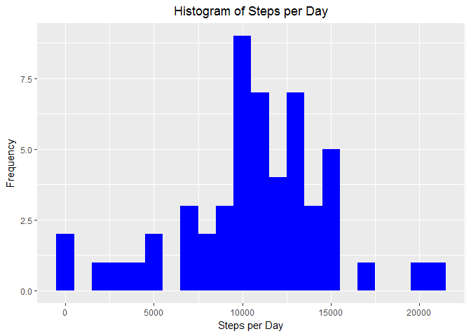
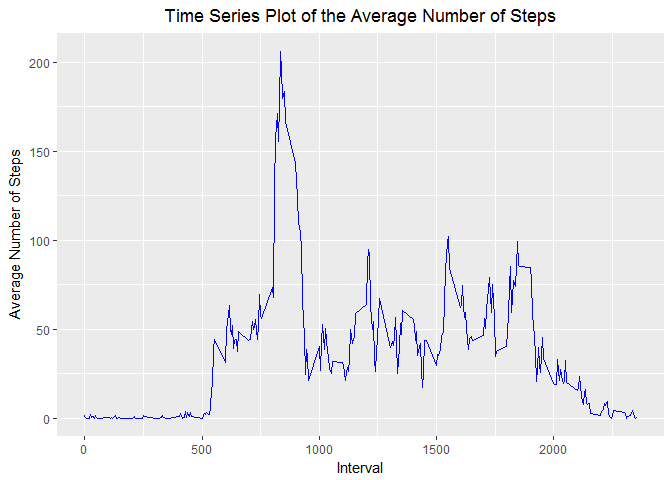
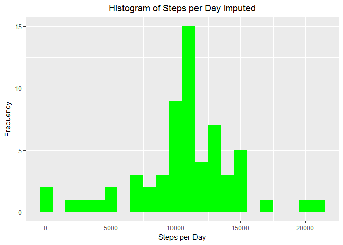
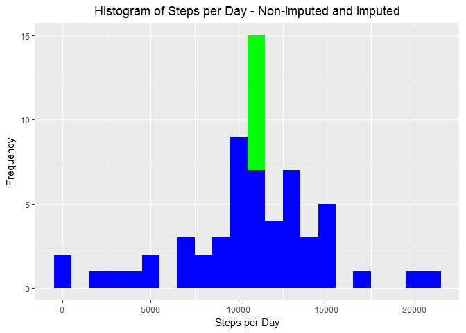
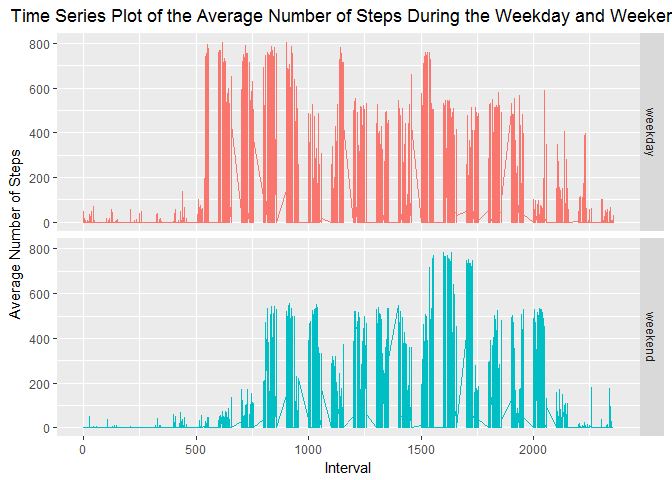

# Reproducible Research: Peer Assessment 1
# Introduction
It is now possible to collect a large amount of data about personal movement using activity monitoring devices such as a Fitbit, Nike Fuelband, or Jawbone Up. These type of devices are part of the “quantified self” movement – a group of enthusiasts who take measurements about themselves regularly to improve their health, to find patterns in their behavior, or because they are tech geeks. But these data remain under-utilized both because the raw data are hard to obtain and there is a lack of statistical methods and software for processing and interpreting the data.

This assignment makes use of data from a personal activity monitoring device. This device collects data at 5 minute intervals through out the day. The data consists of two months of data from an anonymous individual collected during the months of October and November, 2012 and include the number of steps taken in 5 minute intervals each day.

The data for this assignment can be downloaded from the course web site:

Dataset: Activity monitoring data [52K]
The variables included in this dataset are:

steps: Number of steps taking in a 5-minute interval (missing values are coded as 𝙽𝙰)
date: The date on which the measurement was taken in YYYY-MM-DD format
interval: Identifier for the 5-minute interval in which measurement was taken
The dataset is stored in a comma-separated-value (CSV) file and there are a total of 17,568 observations in this dataset.

## R Markdown Preparation
Show the code as an output throughout.  Set the default of echo to true.


```r
library(knitr)
opts_chunk$set(echo = TRUE)
opts_chunk$set(message = TRUE)
opts_chunk$set(fig.path = "PA1_template_figures/") 
```
## Load the R Packages
Preload the required R packages to meet the assignment objectives.

```r
library(stringr)
library(ggplot2)
library(lubridate)
```

```
## 
## Attaching package: 'lubridate'
```

```
## The following object is masked from 'package:base':
## 
##     date
```

```r
library(dplyr)
```

```
## 
## Attaching package: 'dplyr'
```

```
## The following objects are masked from 'package:lubridate':
## 
##     intersect, setdiff, union
```

```
## The following objects are masked from 'package:stats':
## 
##     filter, lag
```

```
## The following objects are masked from 'package:base':
## 
##     intersect, setdiff, setequal, union
```
## Loading and preprocessing the data
Show any code that is needed to  
1. Load the data (i.e. read.csv())  
2. Process/transform the data (if necessary) into a format suitable for your analysis

### Loading the Data
Download the data from the source URL and unzip.
1. Download from https://d396qusza40orc.cloudfront.net/repdata%2Fdata%2Factivity.zip
2. Unzip the zip file using unzip.
3. Load the activity data into a data frame using read.csv.


```r
# Download the zipped data from https://d396qusza40orc.cloudfront.net/repdata%2Fdata%2Factivity.zip
url <- "https://d396qusza40orc.cloudfront.net/repdata%2Fdata%2Factivity.zip"
targetFileName <- "repdata-data-activity.zip"
  
# Download only if the zip file hasn't been dowloaded yet.
if (!file.exists(targetFileName)) {
  download.file(url, targetFileName)  
}
  
## Unzip the files if they haven't been extracted
unzipFolderName <- "repdata-data-activity"
unzip(targetFileName, exdir = unzipFolderName)

activityData <- read.csv(paste0(unzipFolderName, "/activity.csv", sep = ""), stringsAsFactors = FALSE)
```
### Preprocessing the data
Format the data into the correct data types.
1. Convert the date column to a date type.
2. Add the datetime column.
3. Add the time column based on the interval column.
4. Omit NAs.


```r
activityData$intervalTimeFormat <- gsub("([0-9]{1,2})([0-9]{2})", "\\1:\\2", str_pad(activityData$interval, 4, side = "left", pad = "0"))

activityData$datetime <- strptime(paste0(activityData$date, activityData$intervalTimeFormat, sep=""), format="%Y-%m-%d %H:%M")
activityData$date <- ymd(activityData$date)
activityData$time <- hms(paste0(activityData$intervalTimeFormat, ":00", sep=""))
activityData$intervalTimeFormat <- NULL
```

Check the data with str() and head().

```r
str(activityData)
```

```
## 'data.frame':	17568 obs. of  5 variables:
##  $ steps   : int  NA NA NA NA NA NA NA NA NA NA ...
##  $ date    : Date, format: "2012-10-01" "2012-10-01" ...
##  $ interval: int  0 5 10 15 20 25 30 35 40 45 ...
##  $ datetime: POSIXlt, format: "2012-10-01 00:00:00" "2012-10-01 00:05:00" ...
##  $ time    :Formal class 'Period' [package "lubridate"] with 6 slots
##   .. ..@ .Data : num  0 0 0 0 0 0 0 0 0 0 ...
##   .. ..@ year  : num  0 0 0 0 0 0 0 0 0 0 ...
##   .. ..@ month : num  0 0 0 0 0 0 0 0 0 0 ...
##   .. ..@ day   : num  0 0 0 0 0 0 0 0 0 0 ...
##   .. ..@ hour  : num  0 0 0 0 0 0 0 0 0 0 ...
##   .. ..@ minute: num  0 5 10 15 20 25 30 35 40 45 ...
```

```r
head(activityData)
```

```
##   steps       date interval            datetime   time
## 1    NA 2012-10-01        0 2012-10-01 00:00:00     0S
## 2    NA 2012-10-01        5 2012-10-01 00:05:00  5M 0S
## 3    NA 2012-10-01       10 2012-10-01 00:10:00 10M 0S
## 4    NA 2012-10-01       15 2012-10-01 00:15:00 15M 0S
## 5    NA 2012-10-01       20 2012-10-01 00:20:00 20M 0S
## 6    NA 2012-10-01       25 2012-10-01 00:25:00 25M 0S
```

## What is mean total number of steps taken per day?
For this part of the assignment, you can ignore the missing values in the dataset.

1. Calculate the total number of steps taken per day
2. If you do not understand the difference between a histogram and a barplot, research the difference between them. Make a histogram of the total number of steps taken each day
3. Calculate and report the mean and median of the total number of steps taken per day

### Result
1. Calculate the total number of steps taken per day using dplyr and grouping by the date column. Note that using tapply and doing a sum shows 0 steps for 2012-10-01 and other dates. 


```r
totalSteps <- activityData[,c("steps", "date")] %>% 
              filter(!is.na(steps)) %>%
              group_by(date) %>%
              summarize(steps = sum(steps)) %>%
              print
```

```
## # A tibble: 53 × 2
##          date steps
##        <date> <int>
## 1  2012-10-02   126
## 2  2012-10-03 11352
## 3  2012-10-04 12116
## 4  2012-10-05 13294
## 5  2012-10-06 15420
## 6  2012-10-07 11015
## 7  2012-10-09 12811
## 8  2012-10-10  9900
## 9  2012-10-11 10304
## 10 2012-10-12 17382
## # ... with 43 more rows
```
2. Make a histogram of the total number of steps taken each day.  Use ggplot.


```r
g <- ggplot(totalSteps, aes(steps))
g <- g + geom_histogram(fill ="blue", binwidth = 1000) +
      guides(fill = F) +
      xlab("Steps per Day") +
      ylab("Frequency") +
      ggtitle('Histogram of Steps per Day') +
      theme(plot.title = element_text(hjust = 0.5), legend.position = "none")
print(g)
```

<!-- -->

3. Calculate and report the mean and median of the total number of steps taken per day


```r
meanSteps <- mean(totalSteps$steps, na.rm = TRUE)
medianSteps <- median(totalSteps$steps, na.rm = TRUE)
sprintf("Mean steps are %.0f and median steps are %.0f.", meanSteps, medianSteps)
```

```
## [1] "Mean steps are 10766 and median steps are 10765."
```
## What is the average daily activity pattern?
1. Make a time series plot (i.e. type ="1𝚕") of the 5-minute interval (x-axis) and the average number of steps taken, averaged across all days (y-axis)
2. Which 5-minute interval, on average across all the days in the dataset, contains the maximum number of steps?

### Result
1. Using dplyr, calculate the average number of steps in each 5 minute interval per day


```r
meanStepsPerInterval <- activityData[,c("steps", "interval")] %>%
                        filter(!is.na(steps)) %>%
                        group_by(interval) %>%
                        summarize(mean_steps = mean(steps)) %>%
                        print
```

```
## # A tibble: 288 × 2
##    interval mean_steps
##       <int>      <dbl>
## 1         0  1.7169811
## 2         5  0.3396226
## 3        10  0.1320755
## 4        15  0.1509434
## 5        20  0.0754717
## 6        25  2.0943396
## 7        30  0.5283019
## 8        35  0.8679245
## 9        40  0.0000000
## 10       45  1.4716981
## # ... with 278 more rows
```
Use ggplot for the making the time series plot.

```r
g <- ggplot(meanStepsPerInterval, aes(x=interval, y=mean_steps))
g <- g + geom_line(color ="blue") +
      guides(fill = F) +
      xlab("Interval") +
      ylab("Average Number of Steps") +
      ggtitle('Time Series Plot of the Average Number of Steps') +
      theme(plot.title = element_text(hjust = 0.5), legend.position = "none")
print(g)
```

<!-- -->
2. Using which.max, find the 5 minute interval with the maximum number of average steps.


```r
intervalMax <- meanStepsPerInterval[which.max(meanStepsPerInterval$steps),]
```

```
## Warning: Unknown column 'steps'
```

```r
sprintf("5 Minutes Interval with the maximum number of average steps (%.0f) is %i.", intervalMax$steps, intervalMax$interval)
```

```
## Warning: Unknown column 'steps'
```

```
## character(0)
```

## Imputing missing values
Note that there are a number of days/intervals where there are missing values (coded as NA). The presence of missing days may introduce bias into some calculations or summaries of the data.

1. Calculate and report the total number of missing values in the dataset (i.e. the total number of rows with NAs).
2. Devise a strategy for filling in all of the missing values in the dataset. The strategy does not need to be sophisticated. For example, you could use the mean/median for that day, or the mean for that 5-minute interval, etc.
3. Create a new dataset that is equal to the original dataset but with the missing data filled in.
4. Make a histogram of the total number of steps taken each day and calculate and report the mean and median total number of steps taken per day. Do these values differ from the estimates from the first part of the assignment? What is the impact of imputing missing data on the estimates of the total daily number of steps?

### Results
1.  Summarize the missing values.


```r
sumStepsNA <- sum(is.na(activityData$steps))
sprintf("Total number of missing values in the activity dataset is %i", sumStepsNA)
```

```
## [1] "Total number of missing values in the activity dataset is 2304"
```
2. For the impute strategy, if the number of steps is NA, use the mean for the interval.  If the mean for the day is still NA, use 0 steps.


```r
#Get the mean steps per day
meanStepsPerDay <- activityData[!is.na(activityData$steps),c("steps", "date")] %>% 
                    group_by(date) %>% 
                    summarize(mean_steps = mean(steps))

head(meanStepsPerDay, 10)
```

```
## # A tibble: 10 × 2
##          date mean_steps
##        <date>      <dbl>
## 1  2012-10-02    0.43750
## 2  2012-10-03   39.41667
## 3  2012-10-04   42.06944
## 4  2012-10-05   46.15972
## 5  2012-10-06   53.54167
## 6  2012-10-07   38.24653
## 7  2012-10-09   44.48264
## 8  2012-10-10   34.37500
## 9  2012-10-11   35.77778
## 10 2012-10-12   60.35417
```
3. Create a new dataset that is equal to the original dataset but with the missing data filled in.


```r
#Merge the data sets activityData and meanStepsPerDay but do a left outer join.
#activityDataImpute <- merge(activityData, meanStepsPerDay, by = "date", all.x = TRUE, incomparables = 0)
activityDataImpute <- merge(activityData, meanStepsPerInterval, by = "interval", all.x = TRUE)

activityDataImpute$steps <- ifelse(!is.na(activityDataImpute$steps), activityDataImpute$steps, 
                                     ifelse(!is.na(activityDataImpute$mean_steps), activityDataImpute$mean_steps,
                                            0)
                                     )
# Remove the mean_step column
activityDataImpute <- activityDataImpute[, c("steps", "date", "interval", "time", "datetime")]   

head(activityDataImpute, 10)
```

```
##       steps       date interval time   datetime
## 1  1.716981 2012-10-01        0   0S 2012-10-01
## 2  0.000000 2012-11-23        0   0S 2012-11-23
## 3  0.000000 2012-10-28        0   0S 2012-10-28
## 4  0.000000 2012-11-06        0   0S 2012-11-06
## 5  0.000000 2012-11-24        0   0S 2012-11-24
## 6  0.000000 2012-11-15        0   0S 2012-11-15
## 7  0.000000 2012-10-20        0   0S 2012-10-20
## 8  0.000000 2012-11-16        0   0S 2012-11-16
## 9  0.000000 2012-11-07        0   0S 2012-11-07
## 10 0.000000 2012-11-25        0   0S 2012-11-25
```
4.  Impute - Histogram of the total number of steps taken each day and calculate and report the mean and median total number of steps taken per day.

4a. Impute - Histogram of the total number of steps taken each day with missing steps filled in using mean steps per day.
    The histogram shows that the 0 step increased in frequency as there was data where the number of steps on given day is NA for all intervals and we assigned them with 0 steps.

```r
totalStepsImpute <- activityDataImpute[,c("steps", "date")] %>% 
                    filter(!is.na(steps)) %>%
                    group_by(date) %>%
                    summarize(steps = sum(steps)) %>%
                    print
```

```
## # A tibble: 61 × 2
##          date    steps
##        <date>    <dbl>
## 1  2012-10-01 10766.19
## 2  2012-10-02   126.00
## 3  2012-10-03 11352.00
## 4  2012-10-04 12116.00
## 5  2012-10-05 13294.00
## 6  2012-10-06 15420.00
## 7  2012-10-07 11015.00
## 8  2012-10-08 10766.19
## 9  2012-10-09 12811.00
## 10 2012-10-10  9900.00
## # ... with 51 more rows
```

```r
g <- ggplot(totalStepsImpute, aes(steps))
g <- g + geom_histogram(fill ="green", binwidth = 1000) +
      guides(fill = F) +
      xlab("Steps per Day") +
      ylab("Frequency") +
      ggtitle('Histogram of Steps per Day Imputed') +
      theme(plot.title = element_text(hjust = 0.5), legend.position = "none")
print(g)
```

<!-- -->
4a. Non-Impute and Impute - Histogram of the total number of steps taken each day to quickly show the comparison.
    The result shows that using the mean affected the total number of steps taken per day.


```r
gCombined <- ggplot() +
      geom_histogram(data=totalStepsImpute, aes(steps), fill ="green", binwidth = 1000, show.legend = TRUE) +
      geom_histogram(data=totalSteps, aes(steps), fill ="blue", binwidth = 1000, show.legend = TRUE) +
      guides(fill = T) +
      xlab("Steps per Day") +
      ylab("Frequency") +
      ggtitle('Histogram of Steps per Day - Non-Imputed and Imputed') +
      theme(plot.title = element_text(hjust = 0.5))
print(gCombined)
```

<!-- -->

4b. Impute - Calculate and report the mean and median of the total number of steps taken per day


```r
meanStepsImpute <- mean(totalStepsImpute$steps, na.rm = TRUE)
medianStepsImpute <- median(totalStepsImpute$steps, na.rm = TRUE)
sprintf("For the dataset with filled in missing data, mean steps are %.0f and median steps are %.0f.", meanStepsImpute, medianStepsImpute)
```

```
## [1] "For the dataset with filled in missing data, mean steps are 10766 and median steps are 10766."
```

## Are there differences in activity patterns between weekdays and weekends?
For this part the weekdays() function may be of some help here. Use the dataset with the filled-in missing values for this part.

1.  Create a new factor variable in the dataset with two levels – “weekday” and “weekend” indicating whether a given date is a weekday or weekend day.

2.  Make a panel plot containing a time series plot (i.e. type="1") of the 5-minute interval (x-axis) and the average number of steps taken, averaged across all weekday days or weekend days (y-axis). See the README file in the GitHub repository to see an example of what this plot should look like using simulated data.

### Results

1.  New factor variable with two levels - "weekday" and "weekend".

```r
activityDataImputeDow <- activityDataImpute
activityDataImputeDow$day_of_week <- weekdays(activityDataImputeDow$datetime)
activityDataImputeDow$day_of_week_type <- as.factor(ifelse(activityDataImputeDow$day_of_week %in% c("Saturday", "Sunday"), "weekend", "weekday"))

tail(activityDataImputeDow, 10)
```

```
##          steps       date interval       time            datetime
## 17559 0.000000 2012-10-06     2355 23H 55M 0S 2012-10-06 23:55:00
## 17560 0.000000 2012-10-24     2355 23H 55M 0S 2012-10-24 23:55:00
## 17561 0.000000 2012-10-15     2355 23H 55M 0S 2012-10-15 23:55:00
## 17562 0.000000 2012-11-11     2355 23H 55M 0S 2012-11-11 23:55:00
## 17563 0.000000 2012-10-16     2355 23H 55M 0S 2012-10-16 23:55:00
## 17564 0.000000 2012-10-07     2355 23H 55M 0S 2012-10-07 23:55:00
## 17565 0.000000 2012-10-25     2355 23H 55M 0S 2012-10-25 23:55:00
## 17566 0.000000 2012-11-03     2355 23H 55M 0S 2012-11-03 23:55:00
## 17567 1.075472 2012-10-08     2355 23H 55M 0S 2012-10-08 23:55:00
## 17568 1.075472 2012-11-30     2355 23H 55M 0S 2012-11-30 23:55:00
##       day_of_week day_of_week_type
## 17559    Saturday          weekend
## 17560   Wednesday          weekday
## 17561      Monday          weekday
## 17562      Sunday          weekend
## 17563     Tuesday          weekday
## 17564      Sunday          weekend
## 17565    Thursday          weekday
## 17566    Saturday          weekend
## 17567      Monday          weekday
## 17568      Friday          weekday
```
2.  Time series plot (i.e. type="1") of the 5-minute interval (x-axis) and the average number of steps taken, averaged across all weekday days or weekend days (y-axis)


```r
meanStepsPerIntervalDayOfWeekType <- activityDataImputeDow[,c("steps", "interval", "day_of_week_type")] %>%
                              filter(!is.na(steps)) %>%
                              group_by(interval, day_of_week_type) %>%
                              summarize(mean_steps = mean(steps)) %>%
                              print
```

```
## Source: local data frame [576 x 3]
## Groups: interval [?]
## 
##    interval day_of_week_type  mean_steps
##       <int>           <fctr>       <dbl>
## 1         0          weekday 2.251153040
## 2         0          weekend 0.214622642
## 3         5          weekday 0.445283019
## 4         5          weekend 0.042452830
## 5        10          weekday 0.173165618
## 6        10          weekend 0.016509434
## 7        15          weekday 0.197903564
## 8        15          weekend 0.018867925
## 9        20          weekday 0.098951782
## 10       20          weekend 0.009433962
## # ... with 566 more rows
```
Use ggplot for the making the time series plot.

```r
g <- ggplot(activityDataImputeDow, aes(x =interval, y=steps, colour = day_of_week_type))
g <- g + geom_line() +
      facet_grid(day_of_week_type ~ .) +
      guides(fill = F) +
      xlab("Interval") +
      ylab("Average Number of Steps") +
      ggtitle('Time Series Plot of the Average Number of Steps During the Weekday and Weekend') +
      theme(plot.title = element_text(hjust = 0.5), legend.position = "none")
print(g)
```

<!-- -->

The plot shows that filling in the missing data with the average steps per interval increased the number of data points and there are more steps being taken during around the 600 and 900 intervals (6:00 AM to 9:00 AM ) during the weekdays.  This is probably due to the reason that people are waking up earlier during the weekday and going to work as compared to sleeping in durinng the weekend.
